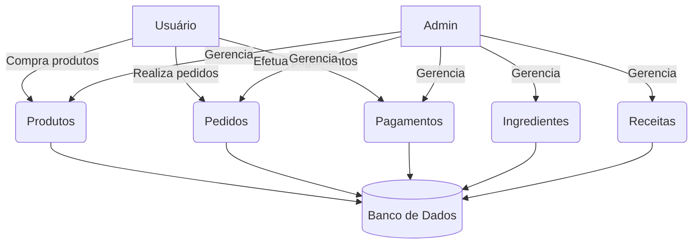

# Desenvolvimento do Site para Loja de Doces e Bolos da Dani

## 👥 Integrantes
- Ryan Dias
- Guilherme
- Gabriel
- Irís

---

## 📝 Descrição do Projeto
O projeto foi desenvolvido para auxiliar a Dani, confeiteira que já realiza vendas via WhatsApp e Instagram. O objetivo principal é facilitar e expandir sua rede de vendas, além de proporcionar melhor controle de estoque, gestão financeira e acompanhamento dos pedidos.

A aplicação permite que os usuários visualizem e comprem produtos, enquanto o administrador pode gerenciar estoque, produtos, ingredientes e visualizar relatórios.

---

## ✅ Funcionalidades

### 👤 Usuário
- Visualizar produtos
- Realizar pedidos
- Cadastro e login com gerenciamento de compras e pedidos

### 🔐 Administrador
- CRUD de produtos, ingredientes e receitas
- Controle de estoque
- Visualização de pedidos pendentes e pagamentos
- Sistema de permissões (ADMIN)

---

## 🛠 Tecnologias Utilizadas

---

## ⚙️ Instalação do Prisma

### ✅ 1. Instalar dependência Prisma
```bash
npm install prisma --save-dev
npx prisma generate
```

### ✅ 2. Instalar dependência durante o desenvolvimento
```bash
npm i express cors dotenv @prisma/client
npm i bcrypt express-session jsonwebtoken nodemailer uuid venom-bot
```

### ✅ 3. Instalar dependências de desenvolvimento
```bash
npm i nodemon cross-env --save-dev
```
> Após isso, um arquivo `.env` e a pasta `prisma/` serão criados.

### ✅ 4. Configuração inicial do banco
npx prisma dev --name init
npx prisma db push --force-reset

### ✅ 5. Criar as migrações
```bash
npx prisma migrate dev --name nome_do_migrate
```
### ✅ 6. Criação do Cliente
```bash
npm run generate
```
### Interface visual do banco
npx prisma studio

### Desenvolvimento
npm run dev

---

## 🛠 Tecnologias Utilizadas

### Backend
| Tecnologia | Função |
|------------|--------|
| Prisma Client | ORM para comunicação com banco de dados |
| Bcrypt | Criptografia de senhas |
| CORS | Controle de acessos entre origens diferentes |
| Dotenv | Leitura de variáveis de ambiente |
| Express | Criação de rotas e servidores HTTP |
| Express-session | Controle de sessões |
| npm | Gerenciador de pacotes |
| JsonWebToken | Geração e validação de tokens JWT |

### Frontend
| Tecnologia | Função |
|------------|--------|
| Axios | Requisições HTTP |
| Bootstrap | Estilização com componentes |
| Next.js | Framework React para SSR/SSG |
| React | Biblioteca para construção de interfaces |
| React-Bootstrap | Componentes estilizados |
| TypeScript | Superset de JS tipado |
| JavaScript | Lógica e comportamento |

---

## 📦 Estrutura de Organização (mermaid)

```

---

## 🚚 Endpoints da API (Swagger)

---

### 🛒 Cart
- **POST /cart** — Adiciona item ao carrinho
- **GET /cart** — Lista itens do carrinho
- **GET /cart/{id}** — Busca item do carrinho
- **PUT /cart/{id}** — Atualiza item do carrinho
- **DELETE /cart/{id}** — Remove item do carrinho

---

### 🧂 Ingredientes
- **POST /ingredientes** — Cria ingrediente
- **GET /ingredientes** — Lista ingredientes
- **GET /ingredientes/{id}** — Detalhes de ingrediente
- **PUT /ingredientes/{id}** — Atualiza ingrediente
- **DELETE /ingredientes/{id}** — Remove ingrediente

---

### 📦 Orders
- **POST /orders** — Cria pedido
- **GET /orders/{id}** — Busca pedido
- **PUT /orders/{id}** — Atualiza pedido
- **DELETE /orders/{id}** — Remove pedido

---

### 💰 Payments
- **POST /payments** — Cria pagamento
- **GET /payments** — Lista pagamentos
- **GET /payments/{id}** — Busca pagamento
- **PUT /payments/{id}** — Atualiza pagamento
- **DELETE /payments/{id}** — Remove pagamento

---

### 🎂 Products
- **POST /products** — Cria produto
- **GET /products** — Lista produtos
- **GET /products/{id}** — Busca produto
- **PUT /products/{id}** — Atualiza produto
- **DELETE /products/{id}** — Remove produto

---

### 📘 Receitas
- **POST /receitas** — Cria receita
- **GET /receitas** — Lista receitas
- **GET /receitas/{id}** — Busca receita
- **PUT /receitas/{id}** — Atualiza receita
- **DELETE /receitas/{id}** — Remove receita

---

### 👤 Users
- **POST /users** — Cria usuário
- **GET /users** — Lista usuários
- **GET /users/{id}** — Busca usuário
- **PUT /users/{id}** — Atualiza usuário
- **DELETE /users/{id}** — Remove usuário
- **POST /users/aunt** — Autentica usuário

---

### 🧰 Contato

Caso haja alguma dúvida sobre o projeto, Entre em contanto nos nossos perfis!